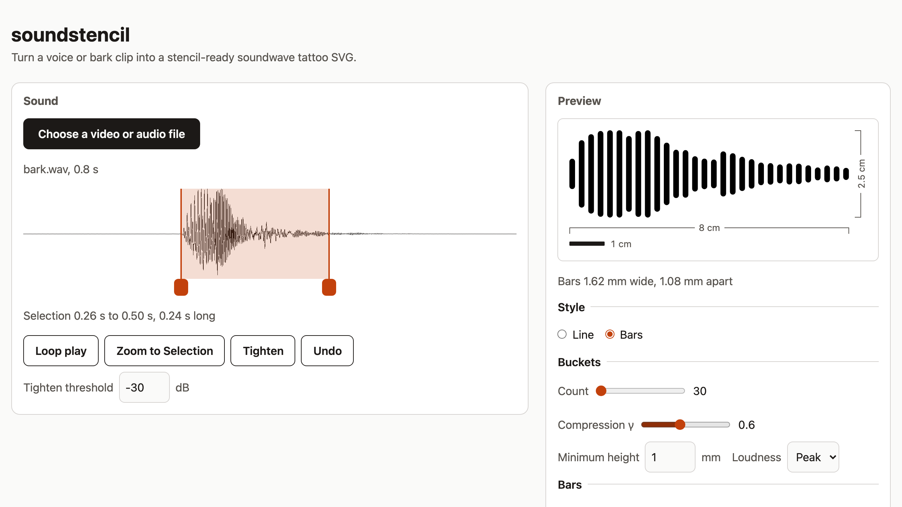

# soundstencil

Turn a voice or bark clip into a stencil-ready soundwave tattoo SVG.

Pick a video or audio file, select the sound, choose a style, and export a black-fills-only SVG sized in real millimetres. Everything runs in your browser: the file never leaves your device. No accounts, no analytics.

**Use it at [soundstencil.dominichanzely.com](https://soundstencil.dominichanzely.com).**



## Use it

1. **Choose a file.** Any video or audio your browser plays: a phone video of your dog, a voice memo. On a phone this opens your camera roll.
2. **Select the sound.** Drag across the waveform, then loop-play to check you've got the whole thing. Drag the handles (or focus one and use the arrow keys) to adjust, and zoom in for precision. **Tighten** moves the Selection edges in past the silence; Undo puts them back.
3. **Pick a Style.** Line (the default) is a smooth oscillating curve. Bars is one rounded bar per Bucket (a slice of the sound). Fewer Buckets gives a bolder, simpler design.
4. **Set the Print Size** to how big the tattoo will be, in cm or inches.
5. **Check for Thin Spots.** Anything outlined in red is thinner than 1 mm at that size, which can blur as a tattoo heals. Fewer Buckets, a thinner Line, or a bigger Print Size helps. It's a warning; export always works.
6. **Download.** Stencil SVG for the artist, PNG if they'd rather have an image (transparent, or tick White background), Editable SVG (Line only) if they want to restyle the curve themselves.

### Taking it to your artist

- Send the **Stencil SVG**. It's black fills only, one shape, sized in real millimetres, so it opens at the right size in Illustrator, Inkscape, or stencil-printer software.
- The **PNG** (for Procreate and other raster apps) is 600 DPI with the DPI written into the file. Printed at 100% (turn off "fit to page") it comes out at true size. Measure it against a ruler before the appointment.
- Artists often redraw by hand anyway. The **Editable SVG** gives them the raw centerline as a stroke to work from.
- Size is up to you and the artist. Where it's going on the body decides how wide it can be, and wider leaves more room between lines.

## Privacy

Your file never leaves your device. It's decoded and drawn in your browser; there is no server to upload to. No accounts, no cookies, no analytics (not even Cloudflare's), no external fonts.

The Content-Security-Policy in [`public/_headers`](public/_headers) enforces that: `default-src 'self'`, plus only `blob:` (decoded media, downloads) and `'wasm-unsafe-eval'` (WebAssembly). `curl -I https://soundstencil.dominichanzely.com` shows it.

The one exception is the ffmpeg fallback: when the browser can't decode a file, it downloads the ffmpeg codec (about 30 MB) from one pinned jsDelivr `@ffmpeg/core` URL, the only other origin the CSP allows. Only the codec is downloaded; your file stays on your device and is converted there (ADR-0001).

A footer on the page states this and links to the CSP.

## Develop

```sh
npm ci
npm run dev        # local server
npm test           # Vitest
npm run test:e2e   # Playwright smoke, Chromium + WebKit (npx playwright install chromium webkit first)
npm run typecheck  # core (no DOM lib) and ui separately
npm run build      # typecheck + Vite build to dist/
```

`src/core/` is the pure pipeline: no DOM, no browser APIs. `tsconfig.core.json` leaves out the DOM lib so any DOM use there fails to typecheck. `src/ui/` is the only layer that touches the page.

## Deploy

Cloudflare Workers with static assets and no Worker script, deployed by Workers Builds on push to `main`. Same shape as dominichanzely.com: serving config lives in `wrangler.jsonc`, only the git connection is dashboard state.

| Setting | Value | Lives in |
|---|---|---|
| Production branch | `main` | dashboard |
| Build command | `npm ci && npm run build` | dashboard |
| Deploy command | `npx wrangler deploy` | dashboard |
| Non-production branch builds | enabled | dashboard |
| Non-production branch deploy command | `npx wrangler preview` | dashboard |
| Branch previews | `<branch>-soundstencil.thedahm.workers.dev` (`preview_urls`, `previews: {}`); also `<branch>.soundstencil.dominichanzely.com` once `previews_enabled` on the route reaches production | `wrangler.jsonc` |
| Root directory | (repo root) | dashboard |
| Build watch paths | include `src/*`, `public/*`, `index.html`, `package.json`, `package-lock.json`, `tsconfig*.json`, `wrangler.jsonc`, `.node-version` | dashboard |
| Node version | `.node-version` | repo |
| Assets directory | `dist/` | `wrangler.jsonc` |
| Headers (CSP) | `public/_headers`, copied to `dist/` by Vite | repo |
| Custom domain | `soundstencil.dominichanzely.com` | `wrangler.jsonc` |
| `workers.dev` hostname | disabled | `wrangler.jsonc` |

wrangler is pinned in `devDependencies`, so the deploy command uses the locked version. CI (`.github/workflows/ci.yml`) runs Vitest, the build, and the Playwright smoke on every push and PR; it does not deploy.

## Contributing

Issues and PRs welcome. Before opening a PR:

- `npm test`, `npm run typecheck`, and `npm run test:e2e` pass.
- New pipeline logic goes in `src/core/` with a Vitest test first. Snapshot SVGs in `test/__snapshots__/` change only on purpose; say why in the PR.
- Use the words in [`CONTEXT.md`](CONTEXT.md) (e.g. Source, Selection, Bucket, Style, Print Size, Thin Spot). Record decisions that are hard to reverse in `docs/adr/`.
- Nothing may reach another origin. `test/privacy.test.ts` and the CSP will stop you; if you think you need to, open an issue first.
- Out of scope for v1 (see [issue #1](https://github.com/thedahm/soundstencil/issues/1)): text overlay (planned for v1.1), noise reduction, accounts, saved projects, QR playback, screen calibration, filled-envelope style.

## License

MIT. See `LICENSE`, and `docs/adr/0001-runtime-fetched-ffmpeg-core.md` for how the GPL ffmpeg fallback is kept out of the distributed code.
